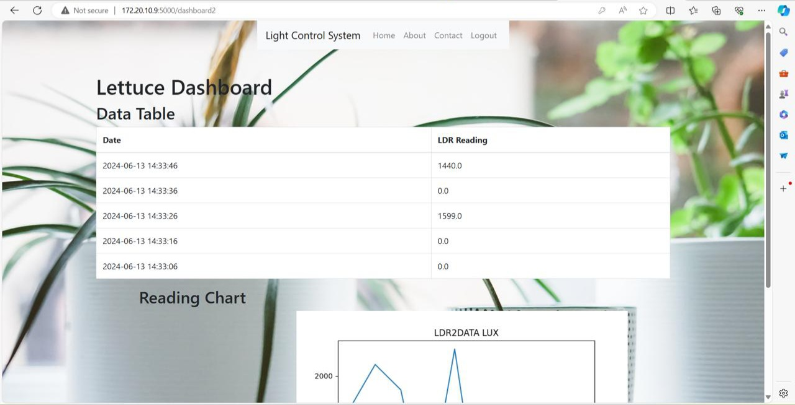

# Distributed Light Intensity Control System for Greenhouse 🌱

## Description
This project is a smart light control system designed for greenhouse environments. It uses a distributed setup that involves:
- Python (backend control logic)
- HTML/CSS (frontend interface)
- Arduino (hardware control)
- MySQL (data logging and control decisions)

## Features
- Real-time light intensity monitoring
- User interface to set thresholds and control lights manually
- Logs data to MySQL database
- Automatically adjusts lighting based on sensor input

## Technologies Used
- Python 3
- Arduino (C++)
- HTML/CSS
- MySQL

## How to Run
1. Upload the Arduino sketch (`light_controller.ino`) to your Arduino board.
2. Create the database using `schema.sql`.
3. Run the backend:  
```bash
python app.py

## 📷 Screenshots

### 🌿 Web Dashboard


### 🔧 Arduino Serial Output




### Hardware


